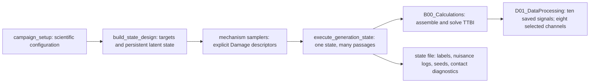

# Damage and EOV model reference

**Status:** authoritative implementation map for the R11 MATLAB generator

**Last checked:** 2026-08-03

This document answers two questions for every modeled mechanism:

1. How is the state generated, in what units, and with what evidentiary status?
2. Which TTBI quantity is changed, by which function, and what is saved?

The production authority for Paper 1 is the MATLAB path beginning at
[`scour_MATLAB/A00_Run.m`](../scour_MATLAB/A00_Run.m). The Python TTBI port is
a development mirror and is not qualifying scientific evidence until its
damaged-response parity is closed. The older repository-only
`docs/stage3_alldamage_spec.md` is archival, is not shipped in dispatch ZIPs,
and must not be used as the current contract.

Here, “damage” is only shorthand for the mechanism collection. Nominal bearing
fixity, rail-profile phase, operational variability, and wheel polygonization
are nuisance or design variables, not measurements of physical damage.

## Reading the model

The global coupled equations use mass, damping, stiffness, and forcing terms
denoted by \(M\), \(C\), \(K\), and \(f\). A mechanism may change a structural
property before assembly, a block of \(C\) or \(K\), or the wheel-path inputs
\(h,\dot h,\ddot h\) used by the time-varying coupled system.

For every linear pad or ballast connection between DOFs \(a,b\), the production
assembler adds

\[
K_{[a,b]}\mathrel{+}=k\begin{bmatrix}1&-1\\-1&1\end{bmatrix},
\qquad
C_{[a,b]}\mathrel{+}=c\begin{bmatrix}1&-1\\-1&1\end{bmatrix}.
\]

Consequently, a multiplier changes exactly those four entries by the same
two-node pattern. The active ballast, unsupported-sleeper, and pad mechanisms
do not change \(M\); the isolated contract test checks the complete global
matrix, not only the expected nonzero entries.

Nominal track-property scope is a separate model-validity boundary. Zhai et
al. (2004) define a 531.4 kg independent vibrating ballast mass at each rail
support point. The inherited bridge assembly instead has no on-bridge ballast
DOF and condenses one retained value onto each deck DOF under a sleeper; this
declared inventory is mesh-invariant, but the deck attachment is not supplied
by Zhai. Full endpoint lumps are a separate author-chosen domain partition.
Zhai also couples adjacent ballast masses with \(K_w,C_w\); the repository
omits that shear branch everywhere, despite the source's reported 12% no-shear
ballast-acceleration overprediction. The inventory correction therefore does
not validate the inherited topology. Table 1 labels its quantities per rail
seat, while the planar property function doubles rail and sleeper terms but
not pad, ballast, or sub-ballast terms. Finally, the source set uses 0.545 m
support spacing, whereas the generator retains the source \(M_b\), \(K_b\),
and \(K_f\) values at 0.600 m without re-evaluating their spacing-dependent
expressions. Ballast topology, one-seat/two-rail scaling, and spacing transfer
are three separate unresolved model-validity questions requiring a derivation,
upstream benchmark, and/or prospective sensitivities at the appropriate scope.

The rail Rayleigh target is another separately classified baseline:
`Track.Rail.Damping.per = 0.1%`. It is not reported by Zhai et al. (2004) and
is retained as an inherited **author-chosen** value. B24 fits the rail
coefficients at bridge-derived reference frequencies. This target must not be
included in a blanket “properties from Zhai” attribution.

Structural stiffness interventions require a second boundary. Scour, bearing
fixity, and crack directly change \(K\), not \(M\), but
[`B24_BeamDamping.m`](../scour_MATLAB/B24_BeamDamping.m) recomputes Rayleigh
coefficients from the first two elastic modes of each assembled state. B00 also
uses those bridge frequencies as the rail damping references. Consequently the
final assembled bridge and coupled-model \(C\) matrices change broadly after a
structural \(K\) intervention. This is the implemented constant-target-modal-
damping closure, not a measured damage-dependent damping law. A paired dynamic
result therefore represents the direct \(K\) intervention plus deterministic
state-specific \(C\) recalibration; a fixed-healthy-Rayleigh sensitivity is
required before calling it a pure stiffness effect.

Evidence labels used below match the manuscript:

- **proxy-informed:** primary evidence supports the mechanism or a limited
  numerical context, but not a universal law for this bridge;
- **author-chosen:** an explicit design distribution, not fitted to field data;
- **contradicted-and-retained:** retained deliberately for sensitivity despite
  contrary evidence, and therefore requiring a sign-sensitivity analysis.

The intended module boundary is strict: `campaign_setup` owns numerical priors;
`build_state_design` owns persistent state/CRN identity; `sample_*` functions
draw explicit descriptors; `B00`/`B02`/`B25`/`B54` apply physics without new
random draws; and `execute_generation_state` saves descriptors, labels, seeds,
and admissibility diagnostics. A new mechanism is incomplete unless all five
layers and an isolated contract test are present.

## One-page mechanism map

| Mechanism | Status and role | Persistence | Direct TTBI change | Saved as |
|---|---|---|---|---|
| Scour surrogate | Active regression target | Per state | Vertical support terms in global \(K\) | `scour_vector` label |
| Nominal bearing fixity | Active target on bearing rungs; latent elsewhere | Per state | Abutment rotational terms in global \(K\) | `bearing_fixity` label and `bearing_vector` stiffness |
| Damaged-element crack | Active nuisance on crack rungs | Per state | Selected element \(I\), hence \(EI\), \(K_e\), and global \(K\) | `crack_log` |
| Ballast patch | Active nuisance on track rungs | Per state | Sleeper-ballast blocks of global \(C\) and \(K\) | `track_log.ballast_patches` |
| Unsupported sleepers | Active nuisance on track rungs | Per state | Selected sleeper-ballast \(c,k\) multiplied by \(10^{-6}\) | `track_log.hanging_groups` |
| Pad service/failure | Active nuisance on track rungs | Per state | Rail-sleeper pad blocks of global \(C\) and \(K\) | `track_log.pad_*` |
| Wheel polygonization | Active nuisance on wheel rungs | Per passage/train | Wheel path \(h,\dot h,\ddot h\), then time-varying coupling and forcing | `oor_log.poly` |
| FRA rail profile | Active EOV, not damage | Fixed or per state by rung | Common wheel path \(h,\dot h,\ddot h\) | `profile_mode`, `profile_log`, named seed |
| Wheel flats | Dormant/unsupported | None in production | Code path exists, but production sampling is disabled | Empty `oor_log.flats` |

Every active mechanism can affect all coupled vehicle, track, and bridge
responses downstream. “Direct change” identifies the first physical term that
the mechanism changes; it does not imply that other solved responses remain
unchanged.

## 1. Scour surrogate: loss of vertical support stiffness

### Physical meaning and equation

The modeled variable is the dimensionless fraction \(d_i\) of vertical support
stiffness lost at support \(i\):

\[
k_{v,i}(d_i)=(1-d_i)k_{v0},\qquad k_{v0}=3.44\times10^8\ \mathrm{N/m}.
\]

The campaign domain is \(0\le d_i\le0.60\). A reported target of 30% means
\(d_i=0.30\), not 30 m, a scour-hole depth, soil-volume loss, or a calibrated
hydraulic state. The 60% ceiling is a design ceiling, not a physical failure
limit.

Evidence status: the linear support-loss idealization and implemented healthy
spring are **proxy-informed** by the drive-by scour model lineage; the sampled
0--60% domain is **author-chosen**. No primary source turns that percentage into
scour depth for this bridge.

### Generation and application

- [`+ttbi/campaign_setup.m`](../scour_MATLAB/+ttbi/campaign_setup.m) defines
  the ceiling, target supports, anchors, and LHS size.
- [`+ttbi/build_state_design.m`](../scour_MATLAB/+ttbi/build_state_design.m)
  creates healthy, single-target anchor, nuisance-only, and joint-LHS states.
- [`+ttbi/execute_generation_state.m`](../scour_MATLAB/+ttbi/execute_generation_state.m)
  writes the row into `Damage.scour_rates`.
- [`B02_BoundaryConditions.m`](../scour_MATLAB/B02_BoundaryConditions.m)
  computes \((1-d_i)k_{v0}\) and attaches it to the support's vertical DOF.
- [`B03_BeamMatrices.m`](../scour_MATLAB/B03_BeamMatrices.m) inserts those
  spring values into the bridge stiffness matrix.

The descriptor directly changes global \(K\), not \(M\), profile, or vehicle
properties. The subsequent state-specific Rayleigh recalibration also changes
assembled \(C\), as explained above. Both can shift all coupled responses.

### Traceability and tests

`scour_vector` and `scour_supports` are saved in every state file. The Python
loader converts the selected fractions to percentage-point regression targets.
[`smoke_damage_toggles.m`](../scour_MATLAB/smoke_damage_toggles.m) checks the
0/30/60% analytic stiffness mapping and malformed-input rejection. The separate
digital-twin lifecycle boundary is checked in the full source repository by
`check_digital_twin_scour_units.py`; this Paper-2 audit check is repository-only
and is not shipped in dispatch ZIPs.

## 2. Nominal bearing fixity: end-restraint design coordinate

### Physical meaning and equation

The sampled variable \(\phi\) is a dimensionless nominal fixity coordinate,
mapped once to an abutment rotational spring:

\[
k_r=\frac{\phi}{1-\phi}\frac{4E_{15}I}{L_{\mathrm{end}}}.
\]

The design uses \(0\le\phi\le0.95\). The conversion uses the fixed 15 °C
reference modulus; subsequent passage temperature changes do not remap
\(k_r\). This is end-restraint uncertainty, not a bearing material-damage
percentage, seizure threshold, or field condition rating.

The spring mechanics and fixity transformation are **proxy-informed**; the
uniform design over \([0,0.95]\) and its anchor placement are **author-chosen**,
not a fitted bearing-condition population.

### Generation and application

- `build_state_design` creates single-abutment anchors and two latent bearing
  dimensions in the joint LHS.
- `execute_generation_state` passes absolute left/right rotational stiffness
  through `Damage.bearing_left` and `Damage.bearing_right`.
- `B02_BoundaryConditions` attaches these values only to the two abutment
  rotational DOFs.
- `B03_BeamMatrices` inserts them into global \(K\).

The direct descriptor-to-matrix intervention is confined to those rotational
stiffness entries; the later state-specific Rayleigh recalibration changes
assembled \(C\) as a dependent modeling closure.

`bearing_fixity` is the dimensionless regression coordinate; `bearing_vector`
stores the corresponding stiffness in N·m/rad. The analytic insertion is
checked in `smoke_damage_toggles.m`.

## 3. Damaged-element crack nuisance

### Physical meaning and prior

The crack abstraction uniformly reduces the second moment of area of one
selected bridge element:

\[
I_e^{\mathrm{dam}}=(1-\gamma)I_e,
\qquad \gamma\sim U(0.05,0.30).
\]

Its complete prior is author-chosen: crack activation probability 0.25 per
semantic state; 4:1 hogging-to-sagging placement odds; location jitter within
±0.175 span of the selected centre; global clamp to \([0.10L,0.90L]\); and
zero effective half-length, which selects one nearest element. It is not a
breathing crack, a crack-depth relation, or the tapered Sinha model.

### Application

- `build_state_design` fixes latent activation by semantic UID.
- [`+ttbi/sample_crack_damage.m`](../scour_MATLAB/+ttbi/sample_crack_damage.m)
  draws the persistent descriptor `crack_locs`, `crack_intensity`, `crack_lc`.
- [`B00_Calculations.m`](../scour_MATLAB/B00_Calculations.m) reduces the
  selected `Beam.Prop.I_n` before bridge assembly.
- `B03_BeamMatrices` uses \(EI_e\) in the element stiffness matrix and hence
  global \(K\).

The descriptor directly changes element/global stiffness only. The later
state-specific Rayleigh recalibration also changes assembled \(C\). `crack_log`
is saved and is never an ML target. `smoke_damage_toggles.m` checks that
exactly one element receives the requested \(I\) ratio.

## 4. Ballast patches

### Prior and evidence status

Patches are persistent spatial multipliers over the 30 m approach, bridge, and
30 m exit descriptor window:

- count: Poisson with rate 1.2 patches per 100 m;
- length: \(U(5,20)\) m;
- centre weighting: 3× within 20 m of either bridge transition;
- wet/dry state: Bernoulli probability 0.5;
- dry: \(\eta_k\sim U(1.2,2.0)\), \(\eta_c\sim U(0.4,0.8)\);
- wet: \(\eta_k\sim U(0.7,0.9)\), \(\eta_c\sim U(1.5,4.0)\).

The wet direction and parts of the spatial context are proxy-informed. Counts,
window, weighting, wet probability, and exact bands are author-chosen. The dry
stiffening band is **contradicted-and-retained**: the nearest measurement
evidence supports softening. It must therefore receive a predeclared
softening-versus-stiffening sensitivity arm before definitive interpretation.
The implemented opt-in paired design is specified in
[`dry_ballast_stiffness_sign_sensitivity.md`](dry_ballast_stiffness_sign_sensitivity.md);
it reverses only dry-patch stiffness at matched log-magnitude and does not
relabel either arm as field truth.

### Application

- [`+ttbi/sample_track_damage.m`](../scour_MATLAB/+ttbi/sample_track_damage.m)
  creates `Damage.track.ballast_patches = [x0,x1,eta_k,eta_c]`.
- [`B54_TrackVectors.m`](../scour_MATLAB/B54_TrackVectors.m) maps patch
  coordinates to sleepers. For overlap, the patch with the largest
  \(|\log\eta_k|\) supplies both \(\eta_k\) and its paired \(\eta_c\); multipliers
  are not multiplied together.
- [`B54_ModelMatrices.m`](../scour_MATLAB/B54_ModelMatrices.m) applies the
  resolved ballast \(k,c\) to sleeper-ballast diagonal and coupling blocks of
  global \(K\) and \(C\), on the approach, bridge, and exit.

The exact persistent descriptor is saved in `track_log`. Current tests cover
placement, overlap parity, isolated full-matrix deltas and unrelated-entry
invariance, combined signal change, and contact admissibility. An isolated
passage-level response-signature study remains required.

## 5. Unsupported-sleeper groups

Groups use an author-chosen Poisson rate of 3 per 100 m and a discrete-uniform
size of 1--5 consecutive sleepers. A location is proposed near a transition
with probability 0.60 within ±15 m, otherwise over the full window, with 3×
odds inside a ballast patch.

`sample_track_damage` stores `[start_position, sleeper_count]`.
`B54_TrackVectors` selects the first sleeper at or after the start and sets the
selected ballast \(k\) and \(c\) multipliers to \(10^{-6}\). `B54_ModelMatrices`
then changes the same sleeper-ballast \(K\) and \(C\) blocks as a ballast patch.
The sampler rejects a proposed start unless the complete sampled count fits on
the realized sleeper lattice inside the modeled window; the application
boundary rejects overflow rather than silently shortening the group.

This is a linear support-removal approximation. It does **not** prescribe rail
or support settlement, void depth, sleeper structural damage, or nonlinear
gap closure and impact. Both weighted-location samplers reject the entire state
draw if 50 proposals fail; they never retain a rejected final proposal.
Production-sampler distribution testing remains required before generation.

## 6. Rail-pad service condition and sparse failures

The state-persistent pad descriptor combines:

- one global stiffness multiplier drawn from Weibull(scale 1.8, shape 2.2),
  clipped to \([1.0,3.5]\);
- one global damping multiplier \(U(0.8,1.2)\);
- independent Bernoulli failure probability 0.02 at each unique 0.6 m sleeper
  lattice location.

These are author-chosen service-condition priors, not a temporal aging model.
`sample_track_damage` stores the scalars and exact failure-lattice coordinates.
`B54_TrackVectors` scales all rail-pad \(k,c\); at a failure it sets both to
\(10^{-6}\) at that sleeper. Off-lattice, duplicate, nonfinite, or
out-of-modeled-sleeper-domain failure descriptors are rejected rather than
snapped. `B54_ModelMatrices` changes the rail-to-
sleeper diagonal/coupling blocks of global \(K\) and \(C\).

The model contains no ARIMA aging field, failure clustering, or consecutive-
failure cap. Existing tests cover fail-closed descriptor boundaries, lattice
placement, separate service/failure full-matrix deltas, unrelated-entry
invariance, and combined response. Boundary prior-range validation and isolated
passage-level response signatures remain required.

## 7. Wheel polygonization

For each passage, each of the five modeled vehicles represents a fresh fleet
draw. Every wheel has author-chosen probability 0.30 of polygonization, with
order \(n\sim DU(1,5)\) and

\[
\log A\sim N(-10,0.5^2),\qquad A\in[10,120]\ \mu\mathrm{m}.
\]

[`+ttbi/sample_wheel_oor.m`](../scour_MATLAB/+ttbi/sample_wheel_oor.m) saves
rows `[vehicle,wheel,order,amplitude_m,phase_rad]` in `Damage.oor_poly`.
[`B25_WheelProfiles.m`](../scour_MATLAB/B25_WheelProfiles.m) adds

\[
h_{\mathrm{poly}}(x)=A\cos(nx/R+\varphi)
\]

to the selected wheel path before differentiating it. Thus
\(h,\dot h,\ddot h\) carry the mechanism into the time-varying coupling and
force terms in `B65_DynamicCalcCoupledFaster.m`; `B66_ContactForce.m` uses the
same path derivatives when reconstructing wheel--rail reactions.

Polygonization is logged in `oor_log` and is not a target. The isolated
harmonic contract verifies amplitude, order, phase, finite-difference derivative
scaling, superposition, and unrelated-wheel invariance. The bilateral-contact
diagnostic remains the validity boundary; isolated passage-level contact and
response signatures remain required.

## 8. Rail profile and operational EOVs

These variables are not damage mechanisms.

| EOV | Generation/persistence | First direct effect | Evidence status |
|---|---|---|---|
| FRA-v2 class-4 profile | Same PSD/cutoffs in every rung; fixed phase in early rungs or named per-state phase later | Common rail irregularity path \(h,\dot h,\ddot h\) in `B19_GenerateProfile`/`B25_WheelProfiles` | Profile convention is implementation/source provenance; phase persistence is author-chosen |
| Speed | 70--90 km/h LHS, per passage | Vehicle kinematics, excitation frequencies, traversal time | Envelope and rounding are author-chosen |
| Temperature | 3--33 °C LHS, per passage | Deck \(E(T)=E_{15}[1-0.003(T-15)]\), hence bridge \(K\); bearing \(k_r\) is not remapped | Envelope and linear modulus law are author-chosen |
| Vehicle variability | Per-passage Gaussian draws | Car-body mass COV 10%; primary and secondary suspension-stiffness COVs 5%; damping is fixed | All three COVs and the independence model are author-chosen |
| Measurement stress | Loader-side, not generator damage | Symmetric multiplicative 5% stress before PAA; not a calibrated sensor model | Author-chosen robustness stress |

The rail-profile phase rule is a nuisance contrast, not a roughness-class or
measured-profile contrast. The optional profile-intensity branch exists for
legacy/sensitivity use and is not an active rail-damage mechanism.

## 9. Dormant or unsupported mechanisms

### Wheel flats

The sampler and haversine path code exist, but `oor_flats_enabled=false` in
production. Flats caused lift-off/re-contact behavior that a bilateral linear
contact solver cannot represent, and the 1 ms solve is insufficient for their
impact content. They must remain empty and must not be reported as an active
damage mechanism.

### Not represented

The current model does not represent:

- prescribed support or rail settlement;
- rail-section/stiffness damage;
- sleeper structural damage;
- nonlinear sleeper--ballast gaps, closure, or impact;
- nonlinear soil--structure interaction, pier tilt, or pier-member damage;
- physical bearing deterioration or a seizure threshold;
- breathing, tapered, or depth-calibrated cracks;
- suspension degradation; or
- a field-calibrated hydraulic scour-depth-to-stiffness law.

Suspension stiffness and vehicle mass currently vary only as operational fleet
properties. New mechanisms require a separately sourced, isolated rung and
their own numerical/contact validation before being called implemented.

## 10. Saved response channels and downstream targets

[`D01_DataProcessing.m`](../scour_MATLAB/D01_DataProcessing.m) saves the
leading vehicle's three vertical body/bogie accelerations, four values of the
rail FE nodal-acceleration field interpolated at instantaneous wheel
coordinates, and three body/bogie pitch rates. The four historical
`AcelRodaPrimVag`/`Wheel*_Vert` identifiers are legacy storage/display names;
these values are Eulerian partial rail accelerations, not wheelset or total
moving-contact accelerations. The canonical learning input selects the first
two of those four rail-under-wheel channels plus the six body/bogie channels.

Only support-stiffness loss and, where enabled, nominal bearing fixity are
learning targets. Crack, profile, track, polygonization, operations, and
contact diagnostics are logged nuisance variables. They must be used for
stratified diagnostics and residual analysis rather than silently discarded.

## 11. Verification status and required next checks

The isolated matrix and wheel-path contracts are executable in
[`smoke_damage_mechanism_contracts.m`](../scour_MATLAB/smoke_damage_mechanism_contracts.m).

| Contract | Current evidence | Next scientific check |
|---|---|---|
| Scour/bearing boundary mapping | Analytic and fail-closed MATLAB smoke | Mesh and response trend study |
| Crack element mapping | Exact one-element \(I\) ratio smoke | Isolated modal/response fingerprint |
| Ballast overlap/placement | Vector parity, isolated full \(C/K\) delta, combined full solve | Softening/stiffening sensitivity + isolated response signature |
| Unsupported sleepers | Placement, isolated full \(C/K\) delta, combined full solve | Exact sampler distribution + isolated response signature |
| Pad service/failure | Fail-closed descriptor/lattice boundary, separate full \(C/K\) deltas, combined tests | Prior-range validation + isolated response signature |
| Polygonization | Standalone harmonic/derivative contract and combined contact check | Isolated response/contact signature |
| Structural assembly/BC solver | Independent exact-integration/Boolean-assembly oracle, static/modal/damping checks, seven mutation rejections | Coupled dynamic residual and immutable upstream array oracle |
| Numerical solution | Support-aligned production grids, mesh-invariant declared on-bridge ballast inventory, and nonqualifying refinement foundation; healthy modal/contact gates | Ballast topology/shear, per-rail-seat scaling, spacing and finite-domain sensitivities, frozen finite stress cases, coupled mesh/time refinement, upstream benchmark reproduction |
| Lifecycle-to-TTBI units | 0/30/60% Python contract check | Keep in routine check suite |

The exploratory `response_signature_*` harness now catalogs nine isolated
interventions and has executed one canonical healthy-versus-30%-scour passage.
That one pair retained mass and exogenous controls, changed one stiffness
entry, exposed the broad Rayleigh-dependent damping change, lowered all five
matched bridge frequencies, changed the response waveforms, and satisfied the
registered contact limits. The other eight full-passage signatures and the
50-passage registered study remain open; the single pair is not population or
physical-validation evidence.

Modal and contact gates are regression/admissibility checks. They are not, by
themselves, validation that the simulated damage signatures reproduce field
behavior. Numerical verification, model validation against published or
measured behavior, and future field validation must remain separate claims.
The prospective execution boundary and required artifacts are defined in
[`numerical_vv_protocol.md`](numerical_vv_protocol.md).
